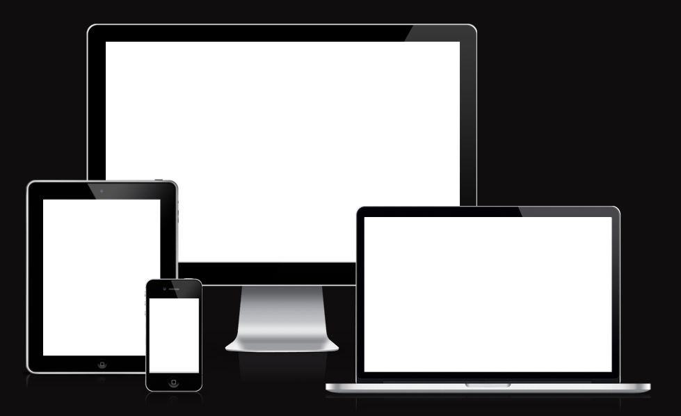
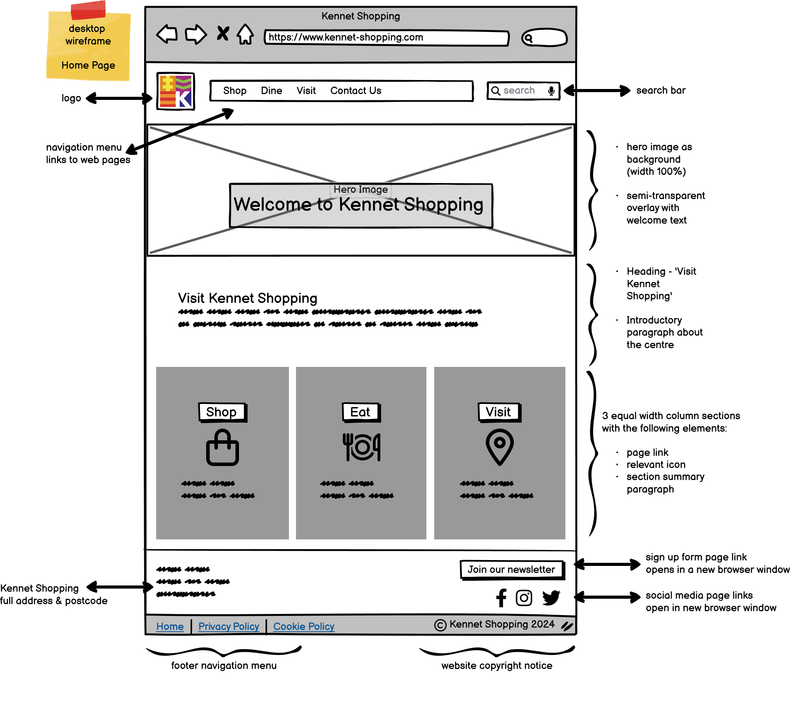
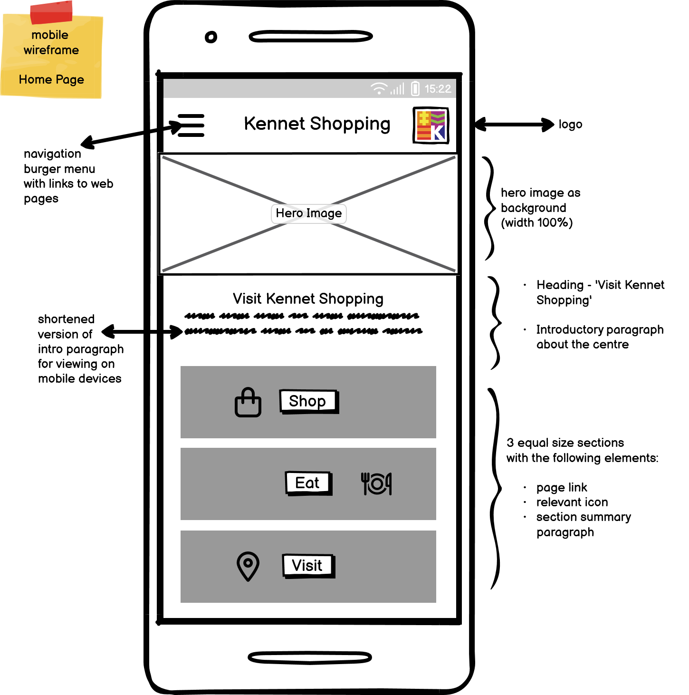

# **KENNET SHOPPING**  

 

 
Kennet Shopping introduction paragraph...
 
 

# Table of Contents

- [Design](#design)
	- [Colours](#colours)
    - [Typography](#typography)
- [UX / UI](#UX/UI)
	- [User Stories](#user-stories)
	- [Wireframes](#wireframes)
- [Features](#features)
	- [Navigation](#navigation)
	- [Footer](#footer)
	- [Home Page](#home-page)
- [Testing](#testing)
    - [Validator Testing](#validator-testing)
    - [Unfixed Bugs](#unfixed-bugs)
- [Deployment](#deployment)
- [Technologies Used](#technologies-used)
	- [Languages Used](#languages-used)
	- [Frameworks, Libraries & Programs Used ](frameworks-libraries-and-programs-used)
- [Credits](#credits)
	- [Content Sources & Generators](#content-sources-and-generators)
    - [Image Sources](#images-sources)
	- [Media Sources](#media-sources)
    

 

## **DESIGN**

### **Colours**

### **Colour Palette Selection Journey**

#### **Stage 1 - Initial Colour Palette Ideas**

When first considering the Kennet Shopping website colour palette, I decided to start by analysing the colours of the actual existing logo of Kennet Shopping, located in Newbury, Berkshire. The design of the Kennet Shopping logo reportedly draws its inspiration from racing silks, which explains the logo's bold patterned squares and likely relates to the longstanding racing heritage of the market town.

The Coolors.co colour picker tool was used to determine all the hex colours in the logo and show many various combinations of colours for use in the website colour palette.

 

#### **Stage 2 - Preliminary Colour Palette Ideas**

The initial colour palette was derived using the colour picker tool from Coolors.co, selecting colours directly from the Kennet Shopping logo. This provided a foundational scheme with the following hex codes: #000000 (Black), #FFFFFF (White), #E08226 (Orange), #A12F84 (Purple), and #303086 (Dark Blue). 

The black and white elements were chosen for their modern, high-contrast appeal, ensuring readability and a sleek, contemporary feel. The orange (#E08226) and purple (#A12F84) introduced vibrant, energetic tones, adding a sense of fun and excitement to the website. These complementary colours create a dynamic and engaging user experience, ideal for attracting a diverse range of shoppers to the center. 

 

#### **Stage 3 - Incorporating An Accent Colour**

Recognizing the need for an additional highlight colour to enhance the visual appeal, the colour picker tool was used again to select an electric blue (#66E6E6) from the photo below which shows exterior cladding of the Kennet Shopping Centre north entrance on Bartholomew street, a sight familiar to all visitors of the centre. 

This colour was intended to maintain aesthetic consistency with the shopping centre's exterior while introducing a lighter, more vibrant shade to the palette. The electric blue serves as a perfect accent colour, adding brightness and a sense of freshness to the website. This vibrant tone not only grabs attention but also enhances the overall energy and appeal of the site's design, making it more engaging for users.

 

#### **Stage 4 - Final Colour Palette Selection**

The final color palette for the Kennet Shopping Centre website includes #000000 (Black), #FFFFFF (White), #E08226 (Orange), #A12F84 (Purple), #303086 (Dark Blue), and the newly added #66E6E6 (Electric Blue).

- Monochromatic black (#000000) and white (#FFFFF) were selected to as a means to juxtapose the brightly coloured hues of the palette and echo the sentiment that Kennet Shopping offers something for everyone, adults and children alike. As a colour palette, this contrasting combination is both highly evocative to users and offers ease of use and functionality from a user experience perspective.

- The dark blue (#303086) was chosen to symbolize the Kennet & Avon Canal, an integral part of Newbury's heritage, grounding the design in the local context. 

- The vibrant orange (#E08226) and purple (#A12F84) continue to convey a sense of fun and modernity, appealing to a wide audience. 

- The addition of electric blue not only enhances the visual hierarchy but also ensures high contrast, making the website accessible to users with impaired vision. 

This carefully curated palette effectively combines heritage with vibrancy, creating an inviting and inclusive digital experience that reflects the lively spirit of the Kennet Shopping Centre.

 

### **Typography**

All fonts used throughout the application were sourced from [Google Fonts](https://fonts.google.com/).

#### **'Barlow Condensed' Font**
- Used for: headings
- I chose to use Barlow Condensed in all capital letters for headings  because the font lends a bold, dynamic presence that stands out, drawing visitors' eyes to important information effortlessly. The condensed nature of this font maximizes space efficiency without sacrificing readability, making it perfect for mobile and desktop views alike. Its clean, streamlined appearance complements a contemporary aesthetic, conveying the modern, lively vibe that Kennet Shopping aims to project. 
  

  

#### **'Montserrat' Font**
- Used for: all other text within application
-  The minimalist typeface of the Montserrat font family provides a blend of modernity and accessibility that appeals to a broad demographic of users to the Kennet Shopping site. This sans-serif font family exudes a clean, contemporary aesthetic and its geometric simplicity and balanced letterforms are visually appealing, evoking a sense of fun and dynamism. Montserrat's design also ensures high readability, with distinct characters and ample spacing that enhance legibility, particularly for users with vision issues. This makes it an accessible choice that maintains a high contrast level against various backgrounds, ensuring that information is clear and easy to read for everyone. 
  

  

## **UX / UI**

### **User Stories**

As a new site user:
- I want a navigation menu on every page so I can navigate to other pages/sections with ease
- I can browse a list of shops/businesses based on specific categories so I can find ones that fit my needs as a customer
- I can view a ‘How To Find Us’ section with Google Map function and public transport information so that I can easily plan my journey to Kennet Shopping 
- I can find accessibility information for Kennet Shopping so I can navigate the shopping centre independently and know what accessible facilities are available to me
- I can access up-to-date centre opening hours so I can plan when to visit Kennet Shopping
- I can access comprehensive information on car parking options and charges so I estimate the cost for my visit
- I want all external links to open to a new page tab so I can easily return to my browsing location on the original website
- I can find the privacy policy so that I can understand how my personal data is being collected, used and protected
- I can submit a contact form so I can communicate my query or message to the relevant department

As a developer: 
- I want to access a README file so that I can understand the scope and purpose of the project and locate essential information regarding the website
- I want to access deployment information so I can follow step-by-step instructions on how to deploy the project

### **Wireframes**

 

 

## **FEATURES**

### **Navigation**

### **Footer**

### **Home Page**

## **TESTING**

### **Validator Testing**
- HTML - 
- CSS -

### **Unfixed Bugs**
- Document any unfixed bugs here...

## **DEPLOYMENT**
- Deployment info here...

## **TECHNOLOGIES USED**

### **Languages Used**
- 
- 

 ## **Frameworks, Libraries & Programs Used**

- - GitHub is a web-based platform for version control using Git, enabling collaborative software development and hosting of code repositories. GitHub connects to GitPod and Heroku. 

-  – Connected to GitHub, GitPod hosted the coding space, allowing the project to be built and then committed to the GitHub repository. Used for version control. 

-  - Diffchecker is a text comparison tool used to highlight the differences between two blocks of text, facilitating comparison and analysis. Update my code against old code for validation.

-  - The W3C CSS Validator is a tool used to check the validity and syntax of CSS code, ensuring compliance with web standards set by the World Wide Web Consortium (W3C). Import my CSS for validation.

-  - The W3C Markup Validator is a tool used to check the validity and syntax of HTML code, ensuring compliance with web standards set by the World Wide Web Consortium (W3C). Import my html for validation.

- - An open-source tool used for auditing web page quality, including performance, accessibility, SEO, and cross-browser testing. Check for validation.

## **CREDITS**

### **Content Sources & Generators**
-   - A favicon.ico icon tool used to generate or download favicon icons in all required sizes. Favicon.io was used to generate favicon.ico file from the Kennet logo JPEG image.

-  - Coolors.co is a online colour palette generator used to visualise and create colour schemes. In this project Coolors was used to pick colours from the Kennet logo and site photo and create a colour palette that reflected the Kennet Shopping ethos and target audience.

-  - Google Fonts is a library of free, open-source fonts available to enhance web design. Google Fonts was used to import all fonts used in the project.

### **Image Credits**
- Image credits here...

### **Media Credits**
- Media credits here...

 
