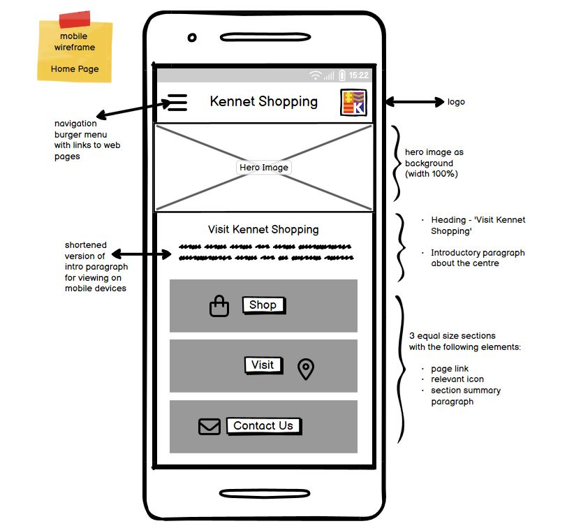
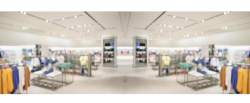

# **KENNET SHOPPING**  

 

# **Introduction**
 
Portfolio Project 1 - Code Institute Full Stack Development Diploma
  
This project is a front end website for Kennet Shopping, a shopping centre in Newbury, Berkshire. Having created a website for Kennet Shopping in 2022 on WordPress, using a drag and drop Elementor template and zero code, I wanted to create a new website using the new coding skills I had recently acquired in HTML and CSS, while in my first two months of study at the Code Institute. The website is user-friendly, responsive and features a contact form where users can interact with Kennet Shopping and a broad range of information on the business, designed with user experience / interface at the forefront of the development aims and purpose.
  
The Kennet Shopping website provides a visually appealling resource for potential and existing customers of the shopping centre, who would like to know more about what the centre has to offer. The website is intentially designed with the target demographic of families in mind and utilises bright bold colours with a modern aesthetic, to demonstrate the core business aim to deliver a fun, enjoyable shopping experience adults and children alike.
  

Deployed website can be be found here: [Kennet Shopping](https://k-nadia.github.io/project-1/index.html)
  

# Table of Contents

- [Design](#design)
	- [Colours](#colours)
    - [Typography](#typography)
- [UX / UI](#UX/UI)
	- [User Stories](#user-stories)
	- [Wireframes](#wireframes)
- [Features](#features)
	- [Navigation](#navigation)
	- [Footer](#footer)
	- [Home Page](#home-page)
- [Testing](#testing)
    - [Validator Testing](#validator-testing)
    - [Unfixed Bugs](#unfixed-bugs)
- [Deployment](#deployment)
- [Technologies Used](#technologies-used)
	- [Languages Used](#languages-used)
	- [Frameworks, Libraries & Programs Used ](frameworks-libraries-and-programs-used)
- [Credits](#credits)
	- [Content Sources & Generators](#content-sources-and-generators)
    - [Image Sources](#images-sources)
	- [Media Sources](#media-sources)
	- [Special Thanks](#special-thanks)
    

 

## **DESIGN**

### **Colours**

### **Colour Palette Selection Journey**

#### **Stage 1 - Initial Colour Palette Ideas**

When first considering the Kennet Shopping website colour palette, I decided to start by analysing the colours of the actual existing logo of Kennet Shopping, located in Newbury, Berkshire. The design of the Kennet Shopping logo reportedly draws its inspiration from racing silks, which explains the logo's bold patterned squares and likely relates to the longstanding racing heritage of the market town.

The Coolors.co colour picker tool was used to determine all the hex colours in the logo and show many various combinations of colours for use in the website colour palette.

 

#### **Stage 2 - Preliminary Colour Palette Ideas**

The initial colour palette was derived using the colour picker tool from Coolors.co, selecting colours directly from the Kennet Shopping logo. This provided a foundational scheme with the following hex codes: #000000 (Black), #FFFFFF (White), #E08226 (Orange), #A12F84 (Purple), and #303086 (Dark Blue). 

The black and white elements were chosen for their modern, high-contrast appeal, ensuring readability and a sleek, contemporary feel. The orange (#E08226) and purple (#A12F84) introduced vibrant, energetic tones, adding a sense of fun and excitement to the website. These complementary colours create a dynamic and engaging user experience, ideal for attracting a diverse range of shoppers to the center. 

 

#### **Stage 3 - Incorporating An Accent Colour**

Recognizing the need for an additional highlight colour to enhance the visual appeal, the colour picker tool was used again to select an electric blue (#66E6E6) from the photo below which shows exterior cladding of the Kennet Shopping Centre north entrance on Bartholomew street, a sight familiar to all visitors of the centre. 

This colour was intended to maintain aesthetic consistency with the shopping centre's exterior while introducing a lighter, more vibrant shade to the palette. The electric blue serves as a perfect accent colour, adding brightness and a sense of freshness to the website. This vibrant tone not only grabs attention but also enhances the overall energy and appeal of the site's design, making it more engaging for users.

 

#### **Stage 4 - Final Colour Palette Selection**

The final color palette for the Kennet Shopping Centre website includes #000000 (Black), #FFFFFF (White), #E08226 (Orange), #A12F84 (Purple), #303086 (Dark Blue), and the newly added #66E6E6 (Electric Blue).

- Monochromatic black (#000000) and white (#FFFFF) were selected to as a means to juxtapose the brightly coloured hues of the palette and echo the sentiment that Kennet Shopping offers something for everyone, adults and children alike. As a colour palette, this contrasting combination is both highly evocative to users and offers ease of use and functionality from a user experience perspective.

- The dark blue (#303086) was chosen to symbolize the Kennet & Avon Canal, an integral part of Newbury's heritage, grounding the design in the local context. 

- The vibrant orange (#E08226) and purple (#A12F84) continue to convey a sense of fun and modernity, appealing to a wide audience. 

- The addition of electric blue not only enhances the visual hierarchy but also ensures high contrast, making the website accessible to users with impaired vision. 

This carefully curated palette effectively combines heritage with vibrancy, creating an inviting and inclusive digital experience that reflects the lively spirit of the Kennet Shopping Centre.

 

### **Typography**

All fonts used throughout the application were sourced from [Google Fonts](https://fonts.google.com/).

#### **'Barlow Condensed' Font**
- Used for: headings
- I chose to use Barlow Condensed in all capital letters for headings  because the font lends a bold, dynamic presence that stands out, drawing visitors' eyes to important information effortlessly. The condensed nature of this font maximizes space efficiency without sacrificing readability, making it perfect for mobile and desktop views alike. Its clean, streamlined appearance complements a contemporary aesthetic, conveying the modern, lively vibe that Kennet Shopping aims to project. 
  

  

#### **'Montserrat' Font**
- Used for: all other text within application
-  The minimalist typeface of the Montserrat font family provides a blend of modernity and accessibility that appeals to a broad demographic of users to the Kennet Shopping site. This sans-serif font family exudes a clean, contemporary aesthetic and its geometric simplicity and balanced letterforms are visually appealing, evoking a sense of fun and dynamism. Montserrat's design also ensures high readability, with distinct characters and ample spacing that enhance legibility, particularly for users with vision issues. This makes it an accessible choice that maintains a high contrast level against various backgrounds, ensuring that information is clear and easy to read for everyone. 
  

  

## **UX / UI**

### **User Stories**

As a new site user:
- I want a navigation menu on every page so I can navigate to other pages/sections with ease
- I can browse a list of shops/businesses based on specific categories so I can find ones that fit my needs as a customer
- I can view a ‘How To Find Us’ section with Google Map function so that I can easily plan my journey to Kennet Shopping 
- I can find accessibility information for Kennet Shopping so I can navigate the shopping centre independently and know what accessible facilities are available to me
- I can access up-to-date centre opening hours so I can plan when to visit Kennet Shopping
- I want all external links to open to a new page tab so I can easily return to my browsing location on the original website
- I can find the privacy policy so that I can understand how my personal data is being collected, used and protected
- I can submit a contact form so I can communicate my query or message to the relevant department

As a developer: 
- I want to access a README file so that I can understand the scope and purpose of the project and locate essential information regarding the website
- I want to access deployment information so I can follow step-by-step instructions on how to deploy the project

### **Wireframes**

 

 

 

## **FEATURES**

### **Navigation Menu**

At the top of the website, users will see the navigation bar menu with Kennet Shopping logo and navigation links to the Home, Shop, Visit and Contact Us pages. The navigation bar is responsive across all devices. The active page is highlighted with a semi-transparent orange colour, so that users are aware of what page they are currently browsing. Clicking on the Kennet Shopping square logo or title heading will redirect users back to the Home page.

When browsing on mobile devices (up to 767px screen width), the navigation menu features a drop-down menu which is opened by clicking on the burger icon in the top right hand corner of the screen. Clicking the burger icon while the drop-down menu is open will close the menu. This is designed to maximum the small amount of screen size available to mobile users and ensure the user experience is not impeded by screen space being taken up where it is not necessary.

Users viewing the site on tablets and desktop screens (over 768px width) will see the navigation menu displayed at the top centre of the screen, with navigation links arranged horizontally. Hovering the cursor over any of the non-active page navigation links will cause the link to highlight in a semi-transparent orange. 

### **Footer**

The footer consists of four responsive column sections ('Find Us', 'Get In Touch', 'Links' and 'Follow Us') which are able to align horizontally or stack on top of one another depending on the width of the users screen.

The four column headings feature the same hover effect used in the 'Contact Us' page, whereby the text gently jumps to the right when hovered over. Column heading names were chosen to give users a clear call-to-action relating to each section, providing unambigious information and hyperlinks which allow users to connect with Kennet Shopping and their local community.

Each icon within the 'Find Us' and 'Get In Touch' sections are electric blue in colour, to add a modern, yet fun accent colour which is also featured in the site colour palette. The social icons beneath the 'Follow Us' sections are white, to highlight them as social media page links and differentiate them from the purely illustrative blue icons. The footer touch targets have been sized and spaced to ensure they meet W3C Web Accessibility Initiative (WAI) standards. All social media links open in a new tab, which enables users to easily return to their browsing location on the site.

Page links are also featured in the footer to give users a quick solution for navigating the site, whether they are near the top of the page or the bottom. Under the footer is the copyright text '2024 Kennet Shopping' which indicates to users that the site is being updated on a regular basis.

### **Home Page - Hero Image**

Below the header navigation menu on the Home page is the hero image. The image is responsive and adapts to all screen sizes, without distorting the image. The image reflects the family-friendly ethos of the Kennet Shopping centre and features a range of different bright colours, thus complementing the multi-coloured Kennet Shopping logo and site colour palette.

### **Home Page - Three Column Section**

This section consists of three equal width columns which interact responsively depending on screen size. When viewing on smaller mobile screens with a max width of 574px the columns stack vertically on top of one another to ensure a positive user experience and good readability, while maintaining the original element design style. Each heading and icon serves as a hyperlink to the corresponding site page associated with each section, to make navigating the site simple and easy to do. The three section topics: 'Shop' 'Visit' and 'Contact Us' focus on the essential information users are likely to want to find from a shopping centre website, however can be difficult to locate in the case of many websites as non-essential content and branding can take over.

### **'Shop' Page**

The 'Shop page features an accordian expand/collapse list which contains details of each individual store, grouped by store category. Once users click on a particular shop section, the individual listing will expand below to reveal the store description, opening hours and telephone contact number. When the top of the section is clicked again, the listing will collapse upwards to it's original display. 

The accordian list is responsive across all screensizes and this list type was chosen in particular to be able to display large amounts of information on mobile screens, while only showing users the information they want to find out about. The list headings are highlighted in colours from the site's colour palette, to create an element of child-like fun and whimsy.

### **'Contact Us' Page**

This page enables users to communicate with Kennet Shopping management via a contact form. The form adapts responsively to all screen sizes, ensuring that the form function is user friendly and can be seen clearly across mobile, tablet and desktop screens. 

The contact form fields are: First Name, Last Name, Email Address and Your Message. All form fields are required by the user in order to submit the form. If any of the fields are left blank when the user clicks the 'Send Message' button, the form will not submit and a message will flag up on the screen which says 'Please fill this field' next to an orange exclamation mark. 

All form fields, as well as the submit button, have the same hover effect featured on the footer links, whereby hover action will make the field move gently to the right. 

The background image for the contact form shows a woman using her phone, which echoes the communicative nature of this particular page. The image is modern, bold and features colours from the site colour palette.

### **'Thank You' Page**

Once the user sucessfully submits the contact form, they will be redirected to the 'Thank You confirmation page, which confirms successful receipt of their message.

### **'Privacy Policy' Page**

The link to the Privacy Policy page can be found within the footer of each page. The Privacy Policy outlines how user data is collected, used, stored, and protected, providing visitors with essential information about their privacy rights and the measures in place to safeguard their personal information. This not only helps comply with legal requirements and regulations, such as GDPR, but also fosters confidence among users by demonstrating a commitment to their privacy and security. 

The privacy policy adjusts responsively according to user screen size by reducing margin values relative to descending screen size. This means that as less screen space is available,  the text content uses a larger proportion of the screen in order to most efficiently utilise the screen real estate available.

### **Features to Implement in the Future**

Additional features I would like to implement to this project would be a custom 404 page and public transport and car parking information on the Visit page.

## **TESTING**

### **General Site Testing**
| Page   | Section           | Page Element                                   | Action (if applicable)                         | Expected Outcome                                   | Result |
|:------:|:-----------------:|:----------------------------------------------:|:----------------------------------------------:|:--------------------------------------------------:|:------:|
| All    | Header            | Kennet Shopping logo                 	  	  | Click on logo                                  | Redirects user to Home Page                        | Pass   |
| All    | Header            | Nav menu (mobile screens up to 767px)          | N/A                                            | Displays burger nav icon on right side of nav menu | Pass   |
| All    | Header            | Nav menu (mobile screens up to 767px)   | Click on burger icon                           | Toggles drop down nav menu                         | Pass       |
| All    | Header            | Nav menu (table screens 768 - 991px)    | N/A                                            | Displays nav menu with center alignment            | Pass       |
| All    | Header            | Nav menu (desktop screens 992px and up) | N/A                                            | Displays nav menu with center alignment            |  Pass      |
| All    | Header          	| Sticky header                           |   Page scroll                                  | Header sticks to top of page when user scrolls down the page, remaining visible   | Pass        |
| All    | Header nav menu   | Nav menu page links                     | Hover over nav menu link                       | Highlights nav menu link in #E08226 (Orange)        | Pass   |
| All    | Header nav menu   | Active page                             | N/A                                            | Active page highlighted in #E08226 (Orange)        | Pass   |
| All    | Header nav menu   | 'Home'                                  | Click on link                                  | Redirects user to 'Home' page                      | Pass   |
| All    | Header nav menu   | 'Shop'                                  | Click on link                                  | Redirects user to 'Shop' page                      | Pass   |
| All    | Header nav menu   | 'Visit'                                 | Click on link                                  | Redirects user to 'Visit' page                     | Pass   |
| All    | Header nav menu   | 'Contact Us'                            | Click on link                                  | Redirects user to 'Contact us' page                | Pass   |
| Home   |  Main             | Hero image                              | N/A                                            | Adjusts responsively according to user screen  size | Pass   |
| Home   |  Section             | Three column sections                              | N/A                                            | Adjusts responsively according to user screen  size | Pass   |
| Home   |  Main		     | 'Shop' H2 heading (Column 1 section)    | Click on H2 text                               | Redirects user to 'Shop' page                      | Pass   |
| Home   |  Main	         | 'Shop' icon (Column 1 section)  		   | Click on icon	                                | Redirects user to 'Shop' page                      | Pass   |
| Home   |  Main	         | 'Visit' H2 heading (Column 2 section)   | Click on H2 text                               | Redirects user to 'Visit' page                     | Pass   |
| Home   |  Main	         | 'Visit' location icon (Column 2 section)| Click on icon	                                | Redirects user to 'Visit' page                     | Pass   |
| Home   |  Main             | 'Contact Us' H2 heading (Column 3 section)   | Click on H2 text                          | Redirects user to 'Contact Us' page                | Pass   |
| Home   |  Main	         | 'Contact Us' envelope icon (Column 3 section)| Click on icon	                            | Redirects user to 'Contact Us' page                | Pass   |
| Shop   |  Main             | All page headings                              | N/A                                     | Adjust responsively according to user screen  size | Pass   |
| Shop   |  Main             | All expand/collapse accordian list elements    | N/A                                     | Adjust responsively according to user screen  size | Pass   |
| Shop   |  Main			 | Store list 'expand' function (Fashion, Clothing & Accessories setion) | Click on any shop name text or '+' icon (for collapsed list items)| List section expands to reveal store information   | Pass   |
| Shop   |  Main			 | Store list 'collapse' function  (Fashion, Clothing & Accessories setion) | Click on any shop name text or '-' icon (for expanded list items)| List section expands to reveal store information   | Pass   |
| Shop   |  Main			 | Store list 'expand' function (Gifts, Cards & Homeware setion) | Click on any shop name text or '+' icon (for collapsed list items)| List section expands to reveal store information   | Pass   |
| Shop   |  Main			 | Store list 'collapse' function  (Gifts, Cards & Homeware setion) | Click on any shop name text or '-' icon (for expanded list items)| List section expands to reveal store information   | Pass   |
| Shop   |  Main			 | Store list 'expand' function (Health & Beauty setion) | Click on any shop name text or '+' icon (for collapsed list items)| List section expands to reveal store information   | Pass   |
| Shop   |  Main			 | Store list 'collapse' function  (Health & Beauty setion) | Click on any shop name text or '-' icon (for expanded list items)| List section expands to reveal store information   | Pass   |
| Shop   |  Main			 | Store list 'expand' function (Electronics & Accessories setion) | Click on any shop name text or '+' icon (for collapsed list items)| List section expands to reveal store information   | Pass   |
| Shop   |  Main			 | Store list 'collapse' function  (Electonics & Accessories setion) | Click on any shop name text or '-' icon (for expanded list items)| List section expands to reveal store information   | Pass   |
| Shop   |  Main			 | Store list 'expand' function (Services & Leisure setion) | Click on any shop name text or '+' icon (for collapsed list items)| List section expands to reveal store information   | Pass   |
| Shop   |  Main			 | Store list 'collapse' function  (Services & Leisure setion) | Click on any shop name text or '-' icon (for expanded list items)| List section expands to reveal store information   | Pass   |
| Shop   |  Main			 | Store list 'expand' function (Groceries & Newsagents setion) | Click on any shop name text or '+' icon (for collapsed list items)| List section expands to reveal store information   | Pass   |
| Shop   |  Main			 | Store list 'collapse' function  (Groceries & Newsagents setion) | Click on any shop name text or '-' icon (for expanded list items)| List section expands to reveal store information   | Pass   |
| Contact Us   |  Main       | Contact form   | N/A                                     | Adjust responsively according to user screen size | Pass   |
| Contact Us| Main			 | Contact form                            | Complete all required form fields and click 'Submit' | Redirects user to 'Thank You' page which displays confirmation message       | Pass       |
| Contact Us| Main			 | Contact form                            | Leave all contact form fields empty and click 'Submit' | 'Please fill in this form' message appears and user is unable to submit form until all required fields are completed       |Pass        |
| Contact Us| Main			 | Contact form                            | Complete some but not all form fields and click 'Submit' | 'Please fill in this form' message appears and user is unable to submit form until all required fields are completed       |Pass        |
| Contact Us| Contact Form			 | Text input box                       | Hover over text input box | Text input box jumps slightly to right while cursor hovers over element     |Pass        |
| Contact Us| Contact Form			 | Submit button                        | Hover over text input box | Text input box jumps slightly to right while cursor hovers over element     |Pass        |
| Thank You| Main		 | Message receipt confirmation box                | N/A | Adjusts responsively according to user screen size     |Pass        |
| Privacy Policy   |  Main       | Privacy Policy   | N/A                                     | Adjust responsively according to user screen size | Pass   |
| All    |  Footer            | Footer column sections                     | N/A                                     | Adjust responsively according to user screen size
| All	 | Footer            | Facebook Socials Icon                   | Click on icon                                  | Open Facebook page in a new tab                    | Pass   |
| All	 | Footer            | Instagram Socials Icon                  | Click on icon                                  | Open Instagram page in a new tab                   | Pass   |
| All	 | Footer            | X / Twitter Socials Icon                | Click on icon                                  | Open x / Twitter in a new tab                      | Pass   |
| All	 | Footer            | Email 'mailto' link		               | Click on link	                                | Opens a new message in user default email client with email recipient 'hello@kennetshopping.com'  | Pass   |
| All	 | Footer            | 'Home' page link		                   | Click on link                                  | Redirects user to 'Home' page                      | Pass   |
| All	 | Footer            | 'Shop' page link               		   | Click on link                                  | Redirects user to 'Shop' page                      | Pass   |
| All	 | Footer            | 'Visit' page link                       | Click on link                                  | Redirects user to 'Visit' page                     | Pass   |
| All	 | Footer            | 'Contact Us' page link                  | Click on link                                  | Redirects user to 'Contact Us' page                | Pass   |
| All	 | Footer            | 'Privacy Policy' page link              | Click on link                                  | Redirects user to 'Privacy Policy' page            | Pass   |

Extensive testing was conducted using Google Chrome Developer Tools, within the Google Chrome browser.

The following simulated mobile devices were tested using the Chrome Developer Tools device mode to emulate user experience on a wide range of devices:

- Galaxy Note II/III/S5 (360px x 640px)
- Galaxy S5 (360 x 640px)
- Galaxy S8 (360px x 740px)
- Galaxy 9+ (320px x 658px)
- Galaxy Tab S4 (712px x 1138px)
- Galazy Z Fold 5 (344px x 882px)
- Samsung Galaxy S8+ (360px 740px)
- Samsung Galaxy S20 Ultra (412px x 915px)
- Samsung Galaxy A51/71 (412px x 914px)
- Nokia N9 (480px x 854px)
- Pixel 3 (393px x 786px)
- Pixel 4 (353px x 745px)
- Pixel 7 (412px x 915px)
- iPhone SE (375px x 667px)
- iPhone XR (414px x 896px)
- iPhone 12 Pro (390px x 844px)
- iPhone 14 Pro Max (430px x 932px)
- iPhone 4 (320px x 480px)
- iPhone 5/SE (320px x 578px)
- iPhone 6/7/8 (375px x 667px)
- iPhone 6/7/8 Plus (414px x 736px)
- iPhone X (375px x 812px)
- iPad (768px x 1024px)
- iPad Pro (1024px x 1366px)
- iPad Mini (768px x 1024px)
- iPad Air (820px x 1180px)
- Asus Zenbook Fold (853px x 1280px)

### **Troubleshooting**

---

### **Issue 1**
At the start of the project there was an issue with my site favicon not displaying. I realised that I had not changed the file path from the default one given by favicon.io in the favicon html code. After amending the file path to include the asset and images folder using a relative path, the problem was rectified and the favicon displayed correctly as seen below.

---
### **Issue 2**
When working on the footer element I found that my footer links were not working. A quick closer inspection of my code showed me that I had inadvertently put the link text (e.g. 'Home) outside of the html 'a href' tag, causing the hyperlink function to fail (screenshot below of incorrect code). Once I amended the code to put all the link text inside of the 'a href' tag, the links worked correctly.

---
### **Issue 3**
As i was running my site to check the footer display , I noticed that for some reason there was a duplicate 'X / Twitter' link that had appeared underneath my other social icons.

I scrutinised my html code (below) and subsequently found that the closing 'a' tag in the footer section was incorrectly placed outside of the parent div element tag and there was also a duplicate 'div' tag inside of the last 'a href' element, which featured the 'X / Twitter' link. I removed the duplicate 'div' tag and moved the 'a' tag to its correct position inside of the parent div element. These actions corrected the issue and the 'X / Twitter' link then functioned correctly.

---
### **Issue 4**
When testing my 'Contact Us' page for mobile responsiveness I noticed that the navigation menu burger icon had suddenly increased in size. 

A little investigating revealed that while styling the contact form envelope icon in style.css (incorrect code shown below), I had negated to target only that specific icon so all icons on the site (including the burger menu icon) were being affected by my style changes.

I realised I needed to specify my style rule to only target icons within the 'contact-form' id, so other icons would not be affected. Once I changed my target element for the style changes from 'i' to '#contact-form i' the issue was no longer present and the burger icon went back to its original intended size.

---

### **Validator Testing**

Google Chrome Dev Tools Lighthouse Testing Results:

<b>Home Page (mobile)</b>
  

<b>Home Page (desktop)</b>
  

<b>Shop Page (mobile)</b>
  

<b>Shop Page (desktop)</b>
  

<b>Contact Us Page (mobile)</b>
  

<b>Contact Us Page (desktop)</b>
  

<b>Visit Us Page (mobile)</b>
  

<b>Visit Us Page (desktop)</b>
  

<b>Thank You Page (mobile)</b>
  

<b>Thank You Page (desktop)</b>
  

<b>Privacy Policy Page (mobile)</b>
  

<b>Privacy Policy Page (desktop)</b>
  

### **Unfixed Bugs**
- I was unable enable toggle function directly on accordion icons.

## **DEPLOYMENT**

This website was deployed to GitHub Pages.

### **Deployment Steps**

Deploy this project using the following steps:
1. Open the responsitory at [Kennet Shopping Github](https://github.com/k-nadia/project-1).
2. Navigate to the 'Settings' tab.
3. Within the 'Code & Automation' section, select 'Pages'
4. Under the 'Branch' section, select 'main' from the drop-down menu.
5. Click on 'save'.
6. Reload the page after a few minutes and the live deployment link will be displayed at the top of the page.

### **Forking Steps**

Fork this project using the following steps:
1. Open the responsitory at [Kennet Shopping Github](https://github.com/k-nadia/project-1).
2. Select the 'Fork' button near the top of the page.
3. After a few minutes the newly forked repository will be created under your GitHub account.

### **Cloning Steps**

Clone this project using the following steps:
1. Open the responsitory at [Kennet Shopping Github](https://github.com/k-nadia/project-1).
2. Select the green 'Code' button near the top of the page.
3. Choose from one of the 3 cloning options: HTTPS, SSH, GitHub CLI.
4. Click on the clipboard icon to copy the URL.
5. Open a new GitPod terminal.
6. Type 'git clone' and paste in the URL copied earlier.
7. Press enter to complete the cloning process. 

## **TECHNOLOGIES USED**

### **Languages Used**
- 
- 

 ## **Frameworks, Libraries & Programs Used**

- - GitHub is a web-based platform for version control using Git, enabling collaborative software development and hosting of code repositories. GitHub connects to GitPod and Heroku. 

-  – Connected to GitHub, GitPod hosted the coding space, allowing the project to be built and then committed to the GitHub repository. Used for version control. 

-  - Diffchecker is a text comparison tool used to highlight the differences between two blocks of text, facilitating comparison and analysis. Update my code against old code for validation.

-  - The W3C CSS Validator is a tool used to check the validity and syntax of CSS code, ensuring compliance with web standards set by the World Wide Web Consortium (W3C). Import my CSS for validation.

-  - The W3C Markup Validator is a tool used to check the validity and syntax of HTML code, ensuring compliance with web standards set by the World Wide Web Consortium (W3C). Import my html for validation.

-  - An open-source tool used for auditing web page quality, including performance, accessibility, SEO, and cross-browser testing. Check for validation.

-  - Optimole is an online image optimizer tool which reduces file size without losing image quality. This tool was used to optimize all images within the project for web.

-  - A graphic design platform that provides online design and visual communication tools.

## **CREDITS**

### **Content Sources**

All text content has been written by myself.

---

Expand/Collapse List starting code from @gregsaxton at copepen.io.
 
 Designer's CodePen profile link - [Click here](https://codepen.io/gregsaxton)
 
 ---

Starting steps and a few lines of code from the Code Institute's Love Running walkthrough project/lesson.
 
Code Institute website link - [Click here](https://codeinstitute.net)  

### **Content Generators**
-   - A favicon.ico icon tool used to generate or download favicon icons in all required sizes. Favicon.io was used to generate favicon.ico file from the Kennet logo JPEG image.

-  - Coolors.co is a online colour palette generator used to visualise and create colour schemes. In this project Coolors was used to pick colours from the Kennet logo and site photo and create a colour palette that reflected the Kennet Shopping ethos and target audience.

-  - Google Fonts is a library of free, open-source fonts available to enhance web design. Google Fonts was used to import all fonts used in the project.

-  - Font Awesome is an icon library and toolkit. Font Awesome was used to source all icons used in this project.

-  - Maps.ie offers a iframes map generator tool used to create and embed responsive Google Maps.

-  - Tool used for generating website and application privacy policies.

### **Image Credits**

*Image Usage - Hero Image (Home Page)*
 
*Photographer - Sunbae Legacy*
 
*Photo Library - Pexels* 
 
*Original Photo Link - [Click Here](https://www.pexels.com/photo/boy-squating-on-white-floor-tile-891289/)*
 

 

*Image Usage - Opening Hours Background Image*
 
*Photographer - Kwangmoozaa*
 
*Photo Library - iStock (stock photo ID: 1388469447)*
 
*Original Photo Link - [Click Here](https://www.istockphoto.com/photo/abstract-blur-clothing-boutique-display-interior-of-shopping-mall-background-gm1388469447-446105141)*
 

 

*Image Usage - Div Image (Visit Us Page)*
 
*Photographer - Deeagreez*
 
*Photo Library - iStock (stock photo ID: 1202734952)*
 
*Original Photo Link - [Click Here](https://www.istockphoto.com/photo/full-size-photo-of-positive-emotions-girl-tourist-have-shopping-weekends-hold-many-gm1202734952-345417835?clarity=false#)*
 

 

*Image Usage - Kennet Logo (Header & Favicon)*
 
*Designer - Unknown*
 
*Image property of Kennet Shopping*
 

 

### **Special Thanks**

Special thanks to my mentor Diego Pupato for your guidance and support throughout this project.